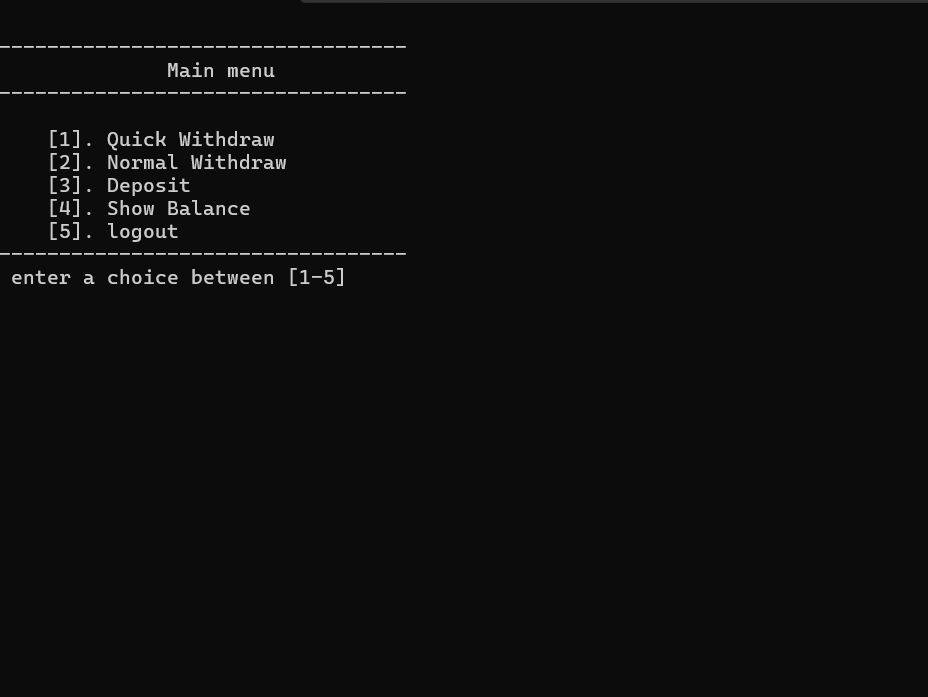
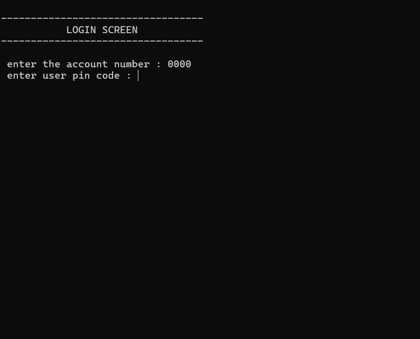
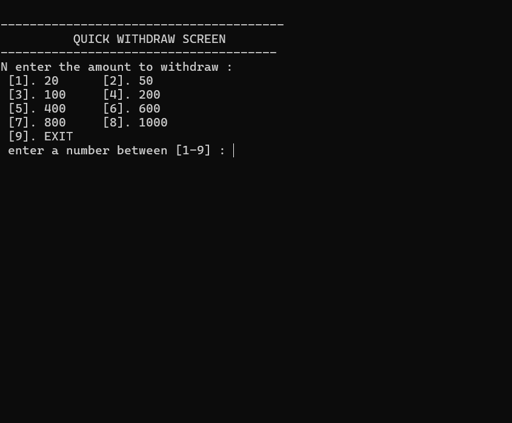

Project Overview 

## ATM SYSTEM

​This project is a console-based ATM simulation built in C++. It demonstrates the core functions of a banking system, including transactions and account management, using file handling for data persistence.

## ​Features

​Secure Login: Provides a login system to validate users.
​Transaction Options: Supports deposits, withdrawals, and balance inquiries.
​Quick & Custom Withdrawals: Offers quick, pre-defined withdrawals and a custom withdrawal option.
​Data Persistence: Saves and loads all client information to a file, ensuring data is saved.
​Modular Code: Designed with clear functions for easy maintenance and readability.

## ​Technologies Used
​C++
​File Handling (fstream)
​Enums and Structs
​Learning Goals

## ​This project helped me learn to:
​Build command-line applications.
​Implement file handling for data persistence.
​Validate transactions and user input.
​Organize code using a modular approach.EnterPProject Overview
​This project is a console-based ATM simulation built in C++. It demonstrates the core functions of a banking system, including transactions and account management, using file handling for data persistence.
